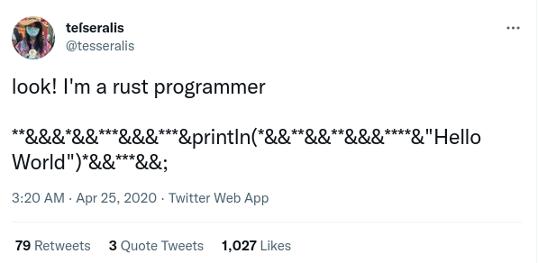

# isrustgood

* [My negative views on Rust](https://chrisdone.com/posts/rust/) - "It’s not the technology that’s working poorly, it’s that you’re using it wrongly."

* [The Rust programming language absolutely positively sucks](https://www.reddit.com/r/rust/comments/12b7p2p/the_rust_programming_language_absolutely/) - "The Rust programming language is atrocious. It is horrible, and I wish it a painful and swift death."

* [Why Golang instead of Rust to develop the Krater desktop app](https://blog.moonguard.dev/why-golang-instead-of-rust-to-develop-the-krater-desktop-app)

* [Rust believes that tech is and always will be political.](https://www.youtube.com/watch?v=_DwaZj3gPYY)

* [Back to Go, Rust is Slow (in Ways That Matter to the Most People)](https://youtu.be/5cEunr8hPE0)

* [Why I hate Rust programming language?](https://www.youtube.com/watch?v=ksTyCQwHGro)

* [I really like Rust but let's be honest the syntax is pretty ugly](https://dev.to/maniflames/comment/oi9f)

* [look! I'm a rust programmer](https://twitter.com/tesseralis/status/1253931849748897792)

* [Yes, Rust is by far the most unreadable language that I've tried.](https://news.ycombinator.com/item?id=21597674)

* [Rust severely disappoints me](http://esr.ibiblio.org/?p=7294)

* [Rust vs. Go](https://blog.ntpsec.org/2017/01/18/rust-vs-go.html)

* [Why Dark didn't choose Rust](https://blog.darklang.com/why-dark-didnt-choose-rust/)

* [First thoughts on Rust vs OCaml](https://blog.darklang.com/first-thoughts-on-rust-vs-ocaml/)

* [Rust is not a good C replacement](https://drewdevault.com/2019/03/25/Rust-is-not-a-good-C-replacement.html)
